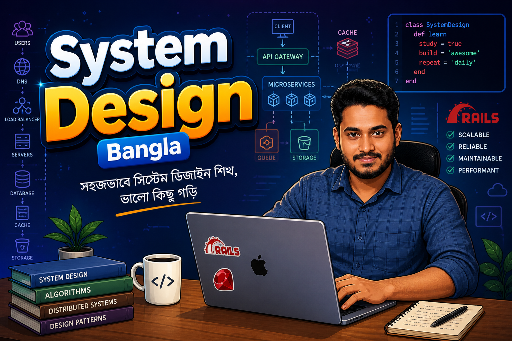
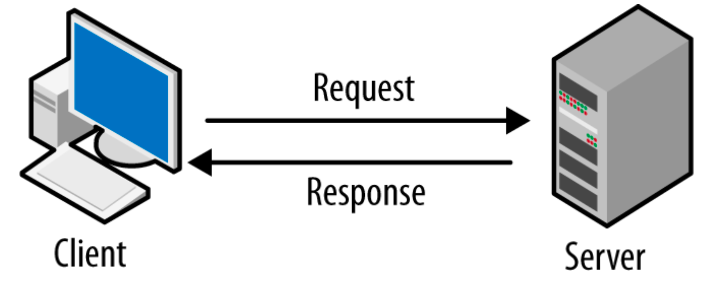

# System Design in Bengali

সিস্টেম ডিজাইন শেখার এই যাত্রায় আমি যা শিখছি, তা এখানে সহজ বাংলায় লিপিবদ্ধ করছি। ভালো লাগলে star, watch কিংবা fork ক্লিক করে রাখতে পারেন।

  

### কেন এই রিপোজিটরি?
- জটিল সিস্টেম ডিজাইন কনসেপ্টগুলো মাতৃভাষায় সহজভাবে বোঝার জন্য।
- Ruby on Rails ডেভেলপারদের জন্য নির্দিষ্ট উদাহরণসহ আর্কিটেকচারাল গাইডলাইন তৈরি করা।
- স্কেলেবল এবং রিলায়েবল অ্যাপ্লিকেশন তৈরির কৌশল শেয়ার করা।

### সূচিপত্র

- [Section 1: System Design](#section-1-system-design)
- [Section 2: Client Server Architecture](#section-2-client-server-architecture)

(চলমান)

উক্ত সূচিপত্র টি এমন ভাবে সাজানো হচ্ছে যেন আমরা একদম Basic থেকে ধীরে ধীরে Advance এর দিকে যেতে পারি। তাই আমার সাজেশন থাকবে আমরা যেন অর্ডার মেইন্টেইন করে এগোতে থাকি।

## Section 1: System Design
সিস্টেম ডিজাইন হলো একটি আর্কিটেকচারাল প্রসেস, যেখানে আমরা একটি সফটওয়্যার সিস্টেমের উপাদান (Components), Modules, Interfaces এবং Data কীভাবে একে অপরের সাথে কাজ করবে তা নির্ধারণ করি। সহজ কথায়, একটি অ্যাপ্লিকেশন যখন হাজার থেকে লক্ষ লক্ষ ইউজারের চাপ নিতে প্রস্তুত করা হয়, তখন তার পেছনের পরিকল্পনাটিই হলো সিস্টেম ডিজাইন। সিস্টেম ডিজাইন এর মুলত আমাদের অ্যাপ্লিকেশান টি কে প্রচুর লোড সহ্য করার সক্ষমতা দেয় এবং কোন প্রকার কানেকশন বিচ্ছিন্নতা বা পারফরম্যান্সের অবনতি ছাড়াই কাজ করতে সাহায্য করে।

কেন সিস্টেম ডিজাইন গুরুত্বপূর্ণ?
একটি ছোট অ্যাপ্লিকেশন তৈরি করা এবং সেটি কয়েক লক্ষ ইউজারের জন্য স্কেল করার মধ্যে বিশাল পার্থক্য রয়েছে। সিস্টেম ডিজাইন আমাদের শেখায়:

Scalability: কীভাবে ক্রমবর্ধমান ইউজারের চাপ সামলানো যায়।

Availability: সিস্টেম যেন কখনো ডাউন না হয় (যেমন: ৯৯.৯৯% আপটাইম)।

Reliability: ভুল বা ত্রুটি হলেও সিস্টেম যেন সঠিকভাবে কাজ চালিয়ে যেতে পারে।

Maintainability: কোড এবং আর্কিটেকচার যেন ভবিষ্যতে সহজে পরিবর্তন বা আপডেট করা যায়।

(আমরা এখানে শুধু মাত্র Backend Engineering related System Design নিয়ে আলোচনা করবো)

## Section 2: Client Server Architecture
সিস্টেম ডিজাইনের দুনিয়ায় Client-Server Architecture হলো সবচেয়ে জনপ্রিয় মডেল। এখানে মূলত একটি সেন্ট্রাল Server থাকে যা সব রিসোর্স এবং ডেটা ম্যানেজ করে, আর অনেকগুলো Clients সেই সার্ভার থেকে সার্ভিস বা ডেটা রিকোয়েস্ট করে। ক্লায়েন্টরা সাধারণত ইউজার ইন্টারফেস বা ইন্টারঅ্যাকশন হ্যান্ডেল করে, আর সার্ভার সামলায় প্রসেসিং এবং স্টোরেজ।

  

🔗 [**আরও পড়ুন: ডেটাবেস ইনডেক্সিং**](./sections/client-server-architecture/README.md)

(চলমান)