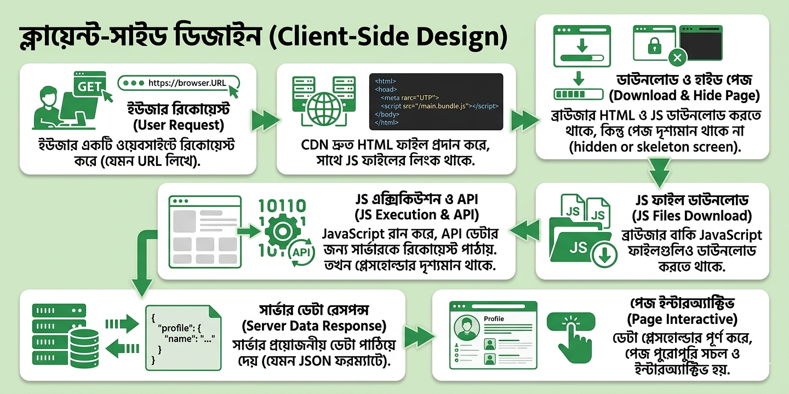
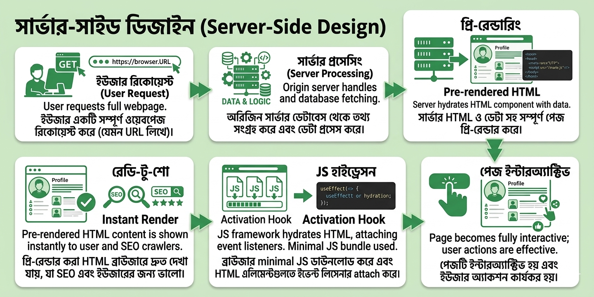

## Section 2: Client Server Architecture
সিস্টেম ডিজাইনের দুনিয়ায় Client-Server Architecture হলো সবচেয়ে জনপ্রিয় মডেল। এখানে মূলত একটি সেন্ট্রাল Server থাকে যা সব রিসোর্স এবং ডেটা ম্যানেজ করে, আর অনেকগুলো Clients সেই সার্ভার থেকে সার্ভিস বা ডেটা রিকোয়েস্ট করে। ক্লায়েন্টরা সাধারণত ইউজার ইন্টারফেস বা ইন্টারঅ্যাকশন হ্যান্ডেল করে, আর সার্ভার সামলায় প্রসেসিং এবং স্টোরেজ।

  

### আর্কিটেকচারের মূল উপাদানসমূহ (Key Components)
একটি সিস্টেম শুধু ক্লায়েন্ট আর সার্ভার দিয়ে হয় না, এর পেছনে আরও অনেক কারিগর থাকে:

- **Client:** এটি এমন একটি ডিভাইস বা অ্যাপ্লিকেশন যা সার্ভারের কাছে সার্ভিস রিকোয়েস্ট পাঠায় এবং সার্ভার থেকে পাওয়া রেজাল্ট প্রসেস করে।

- **Server:** এটি একটি সিস্টেম যা সার্ভিস প্রদান করে, রিকোয়েস্ট প্রসেস করে এবং ডেটা খুঁজে ক্লায়েন্টকে পাঠিয়ে দেয়।

- **Network:** ক্লায়েন্ট এবং সার্ভারের মধ্যে যোগাযোগের মাধ্যম হলো নেটওয়ার্ক, যা বিভিন্ন প্রোটোকল মেনে ডেটা আদান-প্রদান নিশ্চিত করে।

- **Middleware:** এটি একটি মধ্যস্থতাকারী হিসেবে কাজ করে যা অথেন্টিকেশন, লগিং এবং মেসেজ ম্যানেজমেন্টের মতো কাজগুলো সহজ করে।

- **Database:** সার্ভারের সব গুরুত্বপূর্ণ এবং স্ট্রাকচার্ড ডেটা এখানেই জমা থাকে।

- **User Interface (UI):** এটি ক্লায়েন্টের সেই অংশ যার মাধ্যমে ইউজার ইনপুট দেয় এবং আউটপুট দেখে।

- **Application Logic:** এটি হলো আসল কোড বা অ্যালগরিদম যা পুরো সিস্টেমের ডেটা ফ্লো এবং প্রসেসিং নিয়ন্ত্রণ করে।

### Design Principles
একটি কার্যকরী ক্লায়েন্ট-সার্ভার আর্কিটেকচার তৈরির জন্য নিচের ৫টি নীতি মেনে চলা জরুরি:

-  **Modularity:** সিস্টেমকে ছোট ছোট স্বাধীন মডিউলে ভাগ করা (যেমন: ক্লায়েন্ট, সার্ভার, ডাটাবেস) যাতে ডেভেলপমেন্ট এবং টেস্টিং সহজ হয়.
-  **Scalability:** কাজের চাপ বাড়লে সিস্টেম সেই চাপ সামলানর সক্ষমতা থাকা জরুরি. Scalability দুই প্রকার: **Horizontal** (নতুন সার্ভার যোগ করা) এবং **Vertical** (হার্ডওয়্যার আপগ্রেড করা). (এই দুই প্রকার নিয়ে আমরা পরবর্তীতে আলোচনা করবো।)
-  **Reliability and Availability:** সিস্টেম যেন সবসময় সচল থাকে। এর জন্য **Redundancy** (ব্যাকআপ সার্ভার) এবং **Load Balancing** (কাজের চাপ ভাগ করা) ব্যবহার করা হয়.
-  **Performance Optimization:** সিস্টেমের স্পিড বাড়াতে এবং ল্যাটেন্সি কমাতে ভালো প্রোটোকল এবং **Caching** (ঘন ঘন দরকারি ডেটা স্টোর করে রাখা) ব্যবহার করা হয়.
-  **Security:** শুধু অথরাইজড ইউজাররাই যেন সার্ভার এক্সেস করতে পারে এবং ডেটা যেন **Encryption** (SSL/TLS) এর মাধ্যমে সুরক্ষিত থাকে.

### ক্লায়েন্ট-সাইড এবং সার্ভার-সাইড ডিজাইন (Detailed Steps)

এই আর্কিটেকচার টি মূলত দুইভাবে কাজ করতে পারে।

#### Client-Side Design (CSR)

  

-  **User Request:** ইউজার ব্রাউজারে URL লিখে এন্টার প্রেস করে বা কোনো লিংকে ক্লিক করে.

-   **CDN Serves HTML:** একটি CDN দ্রুত একটি HTML ফাইল পাঠায় যাতে জাভাস্ক্রিপ্ট (JS) ফাইলের লিংক থাকে.

-   **Download:** ব্রাউজার প্রথমে HTML এবং তারপর JavaScript ফাইলগুলো ডাউনলোড করে.

-   **JS Execution & API Calls:** ডাউনলোড শেষ হলে JavaScript চলা শুরু করে এবং সার্ভার থেকে আসল ডেটা আনার জন্য API কল দেয়.

-   **Placeholders:** ডেটা না আসা পর্যন্ত ইউজার স্ক্রিনে কিছু খালি জায়গা বা প্লেসহোল্ডার দেখতে পারে.

-   **Data Fill:** সার্ভার থেকে ডেটা চলে আসলে পেজটি পুরোপুরি ইন্টারঅ্যাক্টিভ এবং দৃশ্যমান হয়.

#### Server-Side Design (SSR)

  

-   **User Request:** ইউজার ওয়েবসাইট রিকোয়েস্ট করে.

-   **Ready-to-render HTML:** সার্ভার সব ডেটা প্রসেস করে আগেই "Ready to Render" HTML ফাইল তৈরি করে পাঠিয়ে দেয়.

-   **Quick Render:** ব্রাউজার খুব দ্রুত কন্টেন্ট দেখাতে পারে, তবে সেটা সাথে সাথে ইন্টারঅ্যাক্টিভ হয় না.

-   **JS Download & Recording:** ব্রাউজার এরপর জাভাস্ক্রিপ্ট ডাউনলোড করে এবং ইউজার কোনো ক্লিক করলে তা রেকর্ড করে রাখে.

-   **JS Execution:** ব্রাউজার যখন JS ফ্রেমওয়ার্ক রান করে ফেলে তখন রেকর্ড করা অ্যাকশনগুলো এক্সিকিউট হয় এবং পেজটি পুরোপুরি সচল হয়.
