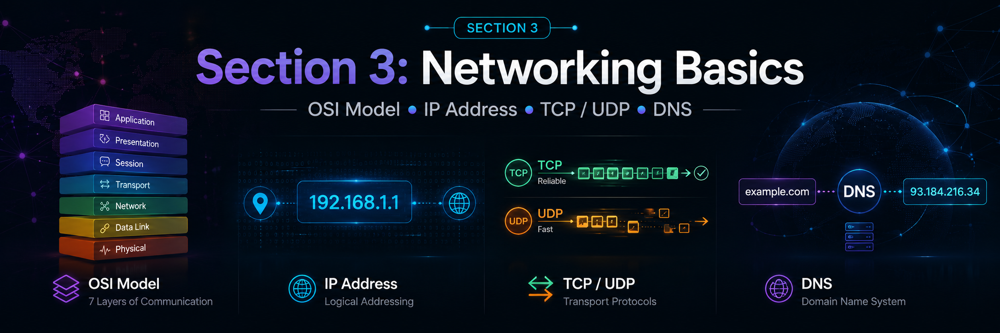
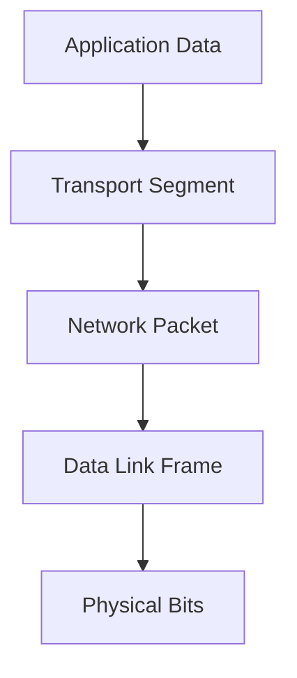
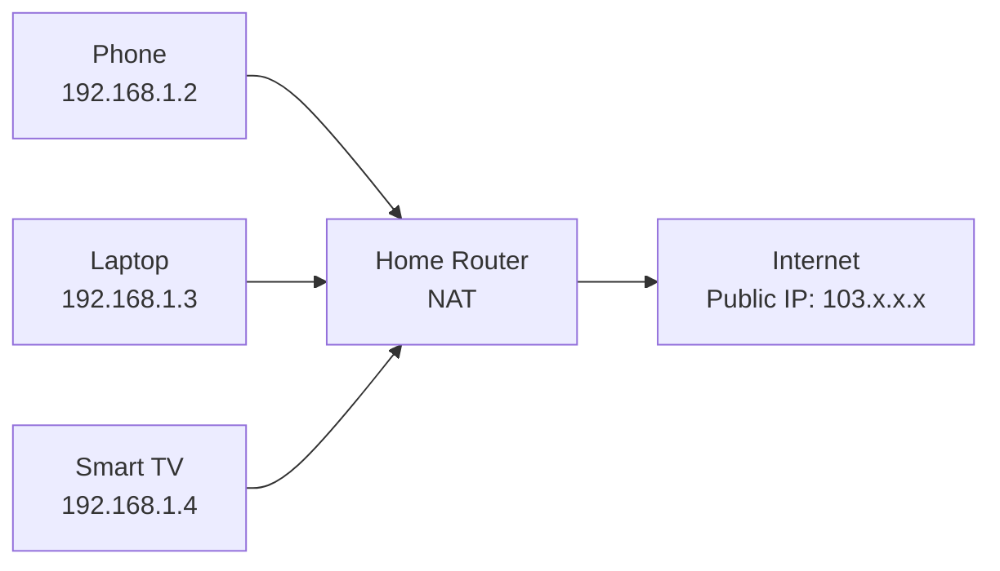
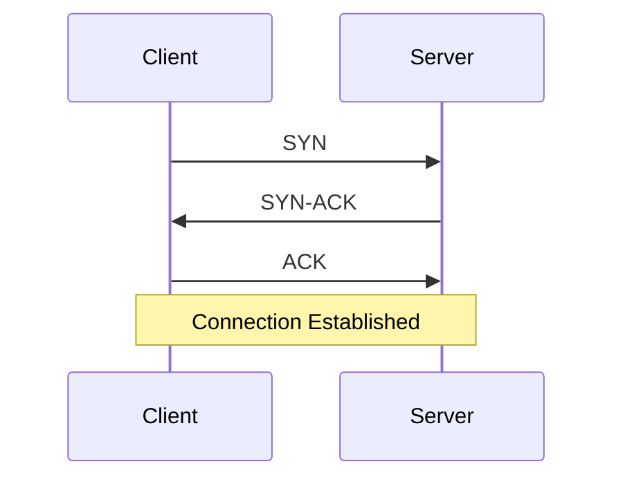
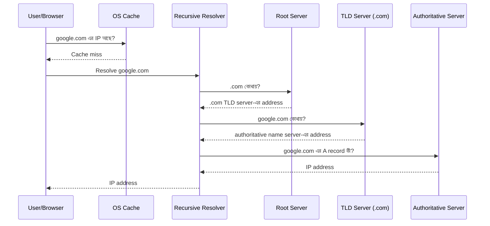
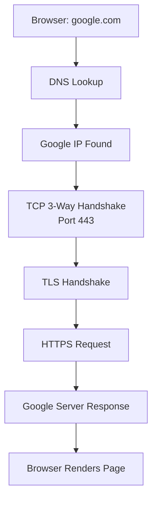

# Section 3: Networking Basics
<p align="center">
  
</p>
সিস্টেম ডিজাইন শেখার সময় Networking Basics খুব গুরুত্বপূর্ণ। কারণ আমরা যখন একটি scalable application design করি, তখন client কীভাবে server-এ request পাঠায়, DNS কীভাবে domain name resolve করে, IP address কীভাবে destination খুঁজে পায়, TCP/UDP কীভাবে data transport করে—এসব না বুঝলে load balancer, CDN, reverse proxy, API gateway, microservice communication, timeout, latency, retry, connection pooling—এসব concept গভীরভাবে বোঝা কঠিন হয়ে যায়।

এই section-এ আমরা ৪টি core networking topic বুঝবো:

1. **OSI Model**
2. **IP Address**
3. **TCP / UDP**
4. **DNS**

> লক্ষ্য: খুব বেশি academic না হয়ে, System Design perspective থেকে concept, example, real-world use case এবং common misconception—সব একসাথে পরিষ্কারভাবে বোঝা।

---

## Table of Contents

- [1. OSI Model](#1-osi-model)
  - [OSI Model কী?](#osi-model-কী)
  - [OSI Model কেন দরকার?](#osi-model-কেন-দরকার)
  - [Data Encapsulation কীভাবে হয়?](#data-encapsulation-কীভাবে-হয়)
  - [OSI Model-এর ৭টি Layer](#osi-model-এর-৭টি-layer)
  - [Real-life Example: Browser দিয়ে Website খোলা](#real-life-example-browser-দিয়ে-website-খোলা)
  - [OSI Model মনে রাখার সহজ উপায়](#osi-model-মনে-রাখার-সহজ-উপায়)
- [2. IP Address](#2-ip-address)
  - [IP Address কী?](#ip-address-কী)
  - [Public IP vs Private IP](#public-ip-vs-private-ip)
  - [Static IP vs Dynamic IP](#static-ip-vs-dynamic-ip)
  - [IPv4 এবং IPv6](#ipv4-এবং-ipv6)
  - [Private IP Range](#private-ip-range)
  - [Unicast, Broadcast, Multicast](#unicast-broadcast-multicast)
  - [NAT কী এবং কেন দরকার?](#nat-কী-এবং-কেন-দরকার)
  - [IP Address System Design-এ কেন গুরুত্বপূর্ণ?](#ip-address-system-design-এ-কেন-গুরুত্বপূর্ণ)
- [3. TCP / UDP](#3-tcp--udp)
  - [Transport Layer কী করে?](#transport-layer-কী-করে)
  - [TCP কী?](#tcp-কী)
  - [TCP 3-Way Handshake](#tcp-3-way-handshake)
  - [UDP কী?](#udp-কী)
  - [TCP vs UDP Comparison](#tcp-vs-udp-comparison)
  - [Real-world Examples](#real-world-examples)
  - [System Design-এ TCP/UDP নির্বাচন](#system-design-এ-tcpudp-নির্বাচন)
- [4. DNS](#4-dns)
  - [DNS কী?](#dns-কী)
  - [DNS কীভাবে কাজ করে?](#dns-কীভাবে-কাজ-করে)
  - [DNS Server-এর ধরন](#dns-server-এর-ধরন)
  - [Important DNS Record Types](#important-dns-record-types)
  - [DNS Caching এবং TTL](#dns-caching-এবং-ttl)
  - [DNS Security](#dns-security)
  - [System Design-এ DNS-এর গুরুত্ব](#system-design-এ-dns-এর-গুরুত্ব)
- [Chapter Summary](#chapter-summary)

---

# 1. OSI Model

## OSI Model কী?

**OSI** এর পূর্ণরূপ হলো **Open Systems Interconnection**। এটি একটি conceptual বা theoretical model, যা বুঝায় network communication কীভাবে ধাপে ধাপে ঘটে।

এই model টি **ISO (International Organization for Standardization)** দ্বারা তৈরি করা হয়েছিল। OSI Model সরাসরি কোনো software বা hardware নয়। বরং এটি একটি reference model—যার সাহায্যে আমরা বুঝতে পারি networking system-এর বিভিন্ন কাজ কোন layer-এ হয়।

সহজভাবে বললে:

> OSI Model হলো এমন একটি guideline, যা বলে দেয় একটি computer থেকে আরেকটি computer-এ data পাঠানোর সময় data কোন কোন ধাপ অতিক্রম করে।

যখন আমরা browser-এ `google.com` লিখি, তখন মনে হয় browser শুধু Google-এর page খুলে ফেললো। কিন্তু ভিতরে ভিতরে অনেক কাজ হয়:

- Domain name থেকে IP বের হয়
- Connection তৈরি হয়
- Data ছোট ছোট অংশে ভাগ হয়
- Packet destination-এ যায়
- Router/switch packet forward করে
- Receiver data reconstruct করে
- Browser page render করে

এই পুরো journey-কে logically বুঝানোর জন্যই OSI Model ব্যবহার করা হয়।

---

## OSI Model কেন দরকার?

Networking সমস্যা debug করার সময় OSI Model অনেক কাজে লাগে।

ধরুন আপনার application server respond করছে না। সমস্যা কোথায়?

- Cable unplugged? → Physical Layer
- Switch/VLAN issue? → Data Link Layer
- IP routing problem? → Network Layer
- TCP port blocked? → Transport Layer
- TLS/encoding issue? → Presentation Layer
- HTTP/API issue? → Application Layer

System Design এবং Backend Engineering-এ OSI Model বুঝলে নিচের বিষয়গুলো পরিষ্কার হয়:

- Load Balancer কোন layer-এ কাজ করে?
- Router এবং Switch-এর পার্থক্য কী?
- HTTP এবং TCP এক জিনিস নয় কেন?
- IP address এবং MAC address আলাদা কেন?
- HTTPS secure হয় কীভাবে?
- Port number কেন লাগে?
- DNS request আসলে কোথায় fit করে?

---

## Data Encapsulation কীভাবে হয়?

Sender যখন data পাঠায়, তখন data উপর থেকে নিচের দিকে যায়:

```text
Application Layer
Presentation Layer
Session Layer
Transport Layer
Network Layer
Data Link Layer
Physical Layer
```

প্রতিটি layer data-র সাথে নিজের header বা control information যোগ করে। এই process-কে বলা হয় **Encapsulation**।

Receiver side-এ data নিচ থেকে উপরের দিকে যায় এবং প্রতিটি layer নিজের header remove করে। এটাকে বলা হয় **Decapsulation**।



OSI Model-এ data unit বা PDU সাধারণত এভাবে দেখা হয়:

| Layer | Data Unit |
|---|---|
| Application / Presentation / Session | Data |
| Transport | Segment বা Datagram |
| Network | Packet |
| Data Link | Frame |
| Physical | Bits |

---

## OSI Model-এর ৭টি Layer

OSI Model-এর ৭টি layer নিচে উপরের দিক থেকে সাজানো হলো:

```text
7. Application
6. Presentation
5. Session
4. Transport
3. Network
2. Data Link
1. Physical
```

---

## Layer 7: Application Layer

Application Layer হলো user-facing network service layer। এখানে end-user application সরাসরি network service ব্যবহার করে।

যেমন:

- Browser website load করে
- Email client mail পাঠায়
- FTP client file upload/download করে
- SSH দিয়ে remote server access করা হয়

এই layer-এ user application এবং network service-এর মধ্যে interface তৈরি হয়।

### Application Layer-এর কাজ

- Web browsing support করা
- File transfer support করা
- Email communication support করা
- Remote login/access support করা
- Directory service support করা
- Network management support করা
- Application-to-application communication support করা

### Common Protocols

| Protocol | Full Form | Use Case |
|---|---|---|
| HTTP | HyperText Transfer Protocol | Website/API request |
| HTTPS | HTTP Secure | Encrypted website/API request |
| FTP | File Transfer Protocol | File transfer |
| SMTP | Simple Mail Transfer Protocol | Email send |
| POP3 / IMAP | Post Office Protocol / Internet Message Access Protocol | Email receive/read |
| SSH | Secure Shell | Secure remote server access |
| Telnet | Telnet | Insecure remote access |
| DNS | Domain Name System | Domain name to IP resolution |
| DHCP | Dynamic Host Configuration Protocol | Automatically IP assign |
| SMB | Server Message Block | File/printer sharing |

> Note: অনেক বইয়ে DNS/DHCP Application Layer protocol হিসেবে দেখানো হয়, কারণ এগুলো application-level service provide করে। তবে এগুলো transport হিসেবে UDP/TCP ব্যবহার করে।

### Example

যখন আপনি browser-এ `https://example.com` লিখেন, browser Application Layer-এ HTTPS ব্যবহার করে server-এর সাথে communication করে।

---

## Layer 6: Presentation Layer

Presentation Layer data-কে এমন format-এ convert করে, যাতে sender এবং receiver দুজনই data বুঝতে পারে।

সহজভাবে:

> Presentation Layer হলো data translator.

### Presentation Layer-এর কাজ

- Data format conversion
- Character encoding conversion
- Compression
- Encryption
- Decryption
- Serialization / deserialization conceptually এই layer-এর সাথে related

### Example

- Text encoding: UTF-8
- Image format: JPEG, PNG
- Compression: gzip, brotli
- Encryption: TLS/SSL conceptually Presentation Layer-এর সাথে সম্পর্কিত

যখন HTTPS request যায়, data encrypt হয়ে যায়। Receiver side-এ decrypt হয়ে application data পাওয়া যায়।

---

## Layer 5: Session Layer

Session Layer দুইটি device বা application-এর মধ্যে session establish, manage এবং terminate করে।

সহজভাবে:

> Session Layer connection-এর conversation lifecycle manage করে।

### Session Layer-এর কাজ

- Session start করা
- Session maintain করা
- Session terminate করা
- Dialog control
- Checkpointing / recovery conceptually support করা

### Communication Mode

Session বা communication mode সাধারণত ৩ ধরনের হতে পারে:

1. **Simplex**  
   Data একদিকে যায়।  
   Example: Keyboard → Computer

2. **Half Duplex**  
   Data দুইদিকে যেতে পারে, কিন্তু একই সময়ে নয়।  
   Example: Walkie-talkie

3. **Full Duplex**  
   Data দুইদিকে একই সময়ে যেতে পারে।  
   Example: Phone call, modern TCP connection

### Example

Video conference, remote desktop, database session—এসব ক্ষেত্রে session management গুরুত্বপূর্ণ।

---

## Layer 4: Transport Layer

Transport Layer-এর কাজ হলো source application থেকে destination application পর্যন্ত data delivery manage করা।

এই layer host-to-host না, বরং process-to-process communication নিশ্চিত করে। এখানে **port number** ব্যবহার করা হয়।

### Transport Layer-এর কাজ

- Data segmentation
- Reassembly
- Flow control
- Error detection
- Reliability management
- Ordered delivery
- Multiplexing using ports
- Connection-oriented বা connectionless delivery

### Important Protocols

| Protocol | Type | Use Case |
|---|---|---|
| TCP | Connection-oriented, reliable | HTTP/HTTPS, Email, FTP, SSH |
| UDP | Connectionless, fast | DNS, Video call, Gaming, Streaming |

### Segment কী?

Transport Layer data-কে ছোট ছোট অংশে ভাগ করে। TCP-এর ক্ষেত্রে এগুলোকে সাধারণত **Segment** বলা হয়। UDP-এর ক্ষেত্রে বলা হয় **Datagram**।

Segment-এর মধ্যে থাকে:

- Source port
- Destination port
- Sequence number
- Checksum
- Data

### Example

আপনি browser দিয়ে `https://example.com` visit করলে সাধারণত:

- Application Layer: HTTPS
- Transport Layer: TCP
- Destination Port: 443

---

## Layer 3: Network Layer

Network Layer source device থেকে destination device পর্যন্ত packet পৌঁছানোর logical path নির্ধারণ করে।

এই layer-এ **IP Address** ব্যবহার করা হয়।

### Network Layer-এর কাজ

- Logical addressing
- Routing
- Packet forwarding
- Path selection
- Fragmentation conceptually network layer-এও হতে পারে
- Different networks-এর মধ্যে communication

### Important Protocols

| Protocol | Use Case |
|---|---|
| IP | Addressing and routing |
| ICMP | Error reporting, ping |
| IPSec | Secure IP communication |
| OSPF/BGP/RIP | Routing protocols |

### Packet কী?

Network Layer data unit হলো **Packet**।

Packet-এর মধ্যে থাকে:

- Source IP address
- Destination IP address
- Transport layer segment/datagram
- Other control information

### Example

আপনার laptop-এর private IP `192.168.1.10`, আর Google server-এর IP `142.250.x.x`। Network Layer decide করে packet কোন route দিয়ে destination-এ যাবে।

---

## Layer 2: Data Link Layer

Data Link Layer একই local network-এর মধ্যে frame transfer করে। এখানে **MAC Address** ব্যবহার করা হয়।

যদি Network Layer বলে “এই IP-তে packet পাঠাও”, Data Link Layer বলে “local network-এ কোন MAC address-এ frame পাঠাতে হবে?”

### Data Link Layer-এর কাজ

- Framing
- MAC addressing
- Error detection
- Flow control at link level
- Access control
- Local network delivery

### Important Concepts

| Concept | Meaning |
|---|---|
| MAC Address | Physical address of network interface |
| Frame | Data Link Layer data unit |
| Switch | Layer 2 device |
| ARP | IP address থেকে MAC address বের করে |

### ARP কী?

**ARP** এর পূর্ণরূপ হলো **Address Resolution Protocol**।

এর কাজ:

> Local network-এ কোনো IP address-এর corresponding MAC address বের করা।

Example:

```text
IP: 192.168.1.1
MAC: AA:BB:CC:DD:EE:FF
```

আপনার computer router-এ packet পাঠাতে চাইলে প্রথমে router-এর MAC address জানতে হবে। ARP সেই কাজ করে।

---

## Layer 1: Physical Layer

Physical Layer হলো actual physical transmission layer। এখানে data bits আকারে cable, fiber বা wireless signal দিয়ে যায়।

### Physical Layer-এর কাজ

- Bits transmit করা
- Electrical/optical/radio signal manage করা
- Cable, connector, signal rate define করা
- Physical topology support করা

### Physical Medium

- Twisted pair cable
- Coaxial cable
- Fiber optic cable
- Wireless radio signal

### Example

যদি LAN cable unplugged থাকে, তাহলে সমস্যা Physical Layer-এ।

---

## OSI Layer Summary Table

| Layer | Name | Main Responsibility | Data Unit | Example Protocol/Device |
|---|---|---|---|---|
| 7 | Application | User-facing network service | Data | HTTP, DNS, SMTP, FTP |
| 6 | Presentation | Format, encryption, compression | Data | TLS, JPEG, UTF-8, gzip |
| 5 | Session | Session establish/manage/end | Data | RPC, session management |
| 4 | Transport | End-to-end delivery using ports | Segment/Datagram | TCP, UDP |
| 3 | Network | Routing using IP | Packet | IP, ICMP, Router |
| 2 | Data Link | Local delivery using MAC | Frame | Ethernet, ARP, Switch |
| 1 | Physical | Bit transmission | Bits | Cable, Fiber, Wi-Fi signal |

---

## Real-life Example: Browser দিয়ে Website খোলা

ধরুন আপনি browser-এ লিখলেন:

```text
https://google.com
```

তখন প্রায় এই flow ঘটে:

1. **Application Layer**  
   Browser HTTPS request তৈরি করে।

2. **Presentation Layer**  
   TLS encryption data secure করে।

3. **Session Layer**  
   Client-server communication session maintain হয়।

4. **Transport Layer**  
   TCP connection তৈরি হয়, port 443 ব্যবহার করে।

5. **Network Layer**  
   Packet destination IP address অনুযায়ী route হয়।

6. **Data Link Layer**  
   Local network-এ MAC address ব্যবহার করে frame পাঠানো হয়।

7. **Physical Layer**  
   Data bits আকারে cable/Wi-Fi signal দিয়ে যায়।

Receiver side-এ ঠিক উল্টো process হয়।

---

## OSI Model মনে রাখার সহজ উপায়

Top থেকে bottom:

```text
Application
Presentation
Session
Transport
Network
Data Link
Physical
```

Mnemonic:

> **All People Seem To Need Data Processing**

Bottom থেকে top:

```text
Physical
Data Link
Network
Transport
Session
Presentation
Application
```

Mnemonic:

> **Please Do Not Throw Sausage Pizza Away**

---

## OSI Model নিয়ে Common Mistake

### Mistake 1: HTTP আর TCP একই জিনিস ভাবা

HTTP হলো Application Layer protocol। TCP হলো Transport Layer protocol। HTTP সাধারণত TCP-এর উপর চলে।

```text
HTTP/HTTPS → TCP → IP → Ethernet/Wi-Fi
```

### Mistake 2: IP Address আর MAC Address একই ভাবা

IP address logical address। এটি network-to-network routing-এর জন্য ব্যবহৃত হয়।

MAC address physical/local address। এটি local network-এর মধ্যে frame delivery-এর জন্য ব্যবহৃত হয়।

### Mistake 3: ARP Application Layer protocol ভাবা

ARP মূলত IP থেকে MAC resolve করে এবং Data Link/Network boundary-তে কাজ করে। এটাকে Application Layer protocol বলা ঠিক নয়।

### Mistake 4: OSI Model-কে exact implementation ভাবা

বাস্তব Internet stack সাধারণত TCP/IP model follow করে। OSI Model mainly learning এবং troubleshooting reference হিসেবে ব্যবহৃত হয়।

---

# 2. IP Address

## IP Address কী?

**IP** এর পূর্ণরূপ হলো **Internet Protocol**।

IP Address হলো network-এ থাকা কোনো device বা host-এর logical address। এই address ব্যবহার করে এক device আরেক device-কে network-এর মধ্যে খুঁজে পায়।

সহজভাবে:

> IP Address হলো network-এর মধ্যে কোনো device-এর পরিচয় বা ঠিকানা।

যেমন বাস্তব জীবনে চিঠি পাঠাতে address লাগে, তেমনি Internet বা network-এ data পাঠাতে IP address লাগে।

Example:

```text
192.168.1.10
8.8.8.8
142.250.190.46
```

প্রতিটি host-এর সাধারণত দুই ধরনের address থাকে:

| Address Type | Meaning |
|---|---|
| MAC Address | Physical address, device/network interface-এর সাথে related |
| IP Address | Logical address, network communication-এর জন্য ব্যবহৃত |

---

## IP Address কেন দরকার?

IP Address ছাড়া network communication practically সম্ভব নয়। কারণ sender-কে জানতে হয়:

- Data কোথায় পাঠাতে হবে?
- Destination কোন network-এ?
- কোন route দিয়ে packet যাবে?
- Reply কোথায় ফেরত আসবে?

Example:

আপনি যখন `google.com` visit করেন, আপনার computer সরাসরি `google.com` নাম বোঝে না। DNS থেকে Google-এর IP address বের হয়, তারপর packet সেই IP address-এ পাঠানো হয়।

---

## IP Address-এর দুইটি প্রধান অংশ

IPv4 address সাধারণত ২টি logical অংশে ভাগ করা যায়:

1. **Network Part**
2. **Host Part**

Example:

```text
192.168.1.10/24
```

এখানে `/24` মানে প্রথম 24 bits network portion, বাকি 8 bits host portion।

```text
Network: 192.168.1.0
Host:    .10
```

Subnet mask দিয়ে network এবং host অংশ আলাদা করা হয়।

Example:

```text
IP Address:  192.168.1.10
Subnet Mask: 255.255.255.0
CIDR:        /24
```

---

## Public IP vs Private IP

IP address broadly দুই ধরনের হতে পারে:

1. **Public IP**
2. **Private IP**

---

## Public IP Address

Public IP হলো এমন IP address যা Internet থেকে directly reachable।

Example:

```text
8.8.8.8
1.1.1.1
142.250.190.46
```

Public IP সাধারণত ISP assign করে। Web server, API server, DNS server, Load Balancer—এসব Internet-facing system-এর public IP থাকতে পারে।

### Public IP কোথায় ব্যবহার হয়?

- Website hosting
- Public API server
- Cloud Load Balancer
- VPN server
- Mail server
- DNS server

---

## Private IP Address

Private IP হলো এমন IP address যা private/local network-এর মধ্যে ব্যবহার করা হয়। Internet থেকে এগুলো directly reachable নয়।

Example:

```text
192.168.1.10
10.0.0.5
172.16.5.20
```

আপনার বাসার Wi-Fi router সাধারণত connected devices-কে private IP দেয়।

Example:

```text
Phone:       192.168.1.2
Laptop:      192.168.1.3
Smart TV:    192.168.1.4
Router LAN:  192.168.1.1
```

সব device private IP ব্যবহার করলেও Internet-এ বের হওয়ার সময় router NAT ব্যবহার করে public IP share করে।

---

## Private IP Range

RFC 1918 অনুযায়ী IPv4 private address ranges হলো:

| Class-like Range | Private IP Range |
|---|---|
| Class A private range | `10.0.0.0` - `10.255.255.255` |
| Class B private range | `172.16.0.0` - `172.31.255.255` |
| Class C private range | `192.168.0.0` - `192.168.255.255` |

> Practical note: Modern networking-এ classful addressing-এর বদলে CIDR বেশি ব্যবহৃত হয়। তবে Class A/B/C শেখা basic understanding-এর জন্য useful.

---

## Static IP vs Dynamic IP

IP address assignment-এর ভিত্তিতে IP দুই ধরনের হতে পারে:

### Static IP

Static IP manually fixed করা থাকে। এটি change হয় না বা খুব কম change হয়।

Use case:

- Web server
- Database server
- VPN server
- Office firewall
- Production load balancer

Example:

```text
Production API Server: 203.0.113.10
```

### Dynamic IP

Dynamic IP automatically assign হয়, সাধারণত DHCP server দিয়ে।

Use case:

- Home Wi-Fi devices
- Office laptops
- Mobile devices
- ISP consumer connection

Example:

আপনার laptop আজ `192.168.1.12`, কাল router restart হলে `192.168.1.15` পেতে পারে।

---

## DHCP কী?

**DHCP** এর পূর্ণরূপ হলো **Dynamic Host Configuration Protocol**।

DHCP automatically device-কে network configuration দেয়:

- IP address
- Subnet mask
- Default gateway
- DNS server

আপনি যখন Wi-Fi connect করেন, সাধারণত router DHCP server হিসেবে কাজ করে এবং আপনার device-কে IP assign করে।

---

## IPv4 এবং IPv6

## IPv4

IPv4 হলো Internet Protocol Version 4। এটি 32-bit address system।

Example:

```text
192.168.1.10
8.8.8.8
```

IPv4 address ৪টি octet-এ ভাগ করা হয়। প্রতিটি octet 8 bit।

```text
192 . 168 . 1 . 10
8bit  8bit 8bit 8bit
```

IPv4 theoretically প্রায় **4.29 billion** unique address support করে। কিন্তু Internet-connected device অনেক বেশি হয়ে যাওয়ায় IPv4 address shortage তৈরি হয়েছে।

---

## IPv6

IPv6 হলো Internet Protocol Version 6। এটি 128-bit address system।

Example:

```text
2001:4860:4860::8888
```

IPv6 অনেক বড় address space provide করে। ভবিষ্যতের Internet scaling-এর জন্য IPv6 গুরুত্বপূর্ণ।

### IPv4 থেকে IPv6 transition technique

| Technique | Meaning |
|---|---|
| Dual Stack | একই network/device-এ IPv4 এবং IPv6 দুটোই চালানো |
| Tunneling | IPv4 network-এর ভিতর IPv6 packet carry করা |
| Translation | IPv4 এবং IPv6-এর মধ্যে translate করা, যেমন NAT64 |

---

## IP Address Class

পুরোনো classful addressing অনুযায়ী IPv4 address ৫টি class-এ ভাগ করা হতো:

| Class | First Octet Range | Use |
|---|---:|---|
| A | 0 - 127 | Large networks |
| B | 128 - 191 | Medium networks |
| C | 192 - 223 | Small networks |
| D | 224 - 239 | Multicast |
| E | 240 - 255 | Experimental / reserved |

### Class A

Range:

```text
0.0.0.0 - 127.255.255.255
```

Class A বড় network-এর জন্য design করা হয়েছিল। তবে `127.0.0.0/8` loopback address হিসেবে reserved।

Important example:

```text
127.0.0.1 → localhost / loopback
```

### Class B

Range:

```text
128.0.0.0 - 191.255.255.255
```

Medium-sized network-এর জন্য।

### Class C

Range:

```text
192.0.0.0 - 223.255.255.255
```

Small network-এর জন্য।

### Class D

Range:

```text
224.0.0.0 - 239.255.255.255
```

Multicast communication-এর জন্য।

### Class E

Range:

```text
240.0.0.0 - 255.255.255.255
```

Experimental/reserved use-এর জন্য।

Special address:

```text
255.255.255.255 → limited broadcast
```

---

## Unicast, Broadcast, Multicast

Network communication pattern-এর ভিত্তিতে IP communication তিনভাবে দেখা যায়:

---

## Unicast

One-to-one communication।

এক sender এক receiver-এর সাথে communicate করে।

Example:

```text
Your laptop → Google server
```

Use case:

- Website browsing
- API call
- SSH connection
- Database connection

---

## Broadcast

One-to-all communication in a local network।

এক sender local network-এর সব device-কে message পাঠায়।

Example:

```text
ARP request:
"Who has 192.168.1.1? Tell 192.168.1.10"
```

Broadcast সাধারণত local network-এর মধ্যে সীমাবদ্ধ থাকে। Router সাধারণত broadcast forward করে না।

---

## Multicast

One-to-many selected group communication।

এক sender নির্দিষ্ট group-এর members-দের data পাঠায়।

Use case:

- Streaming
- IPTV
- Routing protocol
- Real-time group communication

Class D IP range multicast-এর জন্য ব্যবহৃত হয়:

```text
224.0.0.0 - 239.255.255.255
```

---

## NAT কী এবং কেন দরকার?

**NAT** এর পূর্ণরূপ হলো **Network Address Translation**।

NAT private IP address-কে public IP address-এর মাধ্যমে Internet access করতে সাহায্য করে।

ধরুন আপনার বাসায় ৫টি device আছে:

```text
Phone:    192.168.1.2
Laptop:   192.168.1.3
TV:       192.168.1.4
Tablet:   192.168.1.5
Desktop:  192.168.1.6
```

কিন্তু ISP আপনাকে একটি public IP দিয়েছে:

```text
Public IP: 103.x.x.x
```

সব device কীভাবে একই public IP দিয়ে Internet ব্যবহার করে?

উত্তর: Router NAT ব্যবহার করে।



Router source private IP এবং port track করে রাখে। Reply আসলে সে বুঝতে পারে কোন device-এ response পাঠাতে হবে।

### NAT Table Example

| Private Device | Private Port | Public IP | Public Port |
|---|---:|---|---:|
| 192.168.1.2 | 51510 | 103.x.x.x | 40001 |
| 192.168.1.3 | 51511 | 103.x.x.x | 40002 |

---

## Default Gateway কী?

Default Gateway হলো local network থেকে outside network বা Internet-এ যাওয়ার দরজা।

আপনার device যদি local network-এর বাইরের কোনো IP-তে packet পাঠাতে চায়, তাহলে packet default gateway-তে পাঠায়।

Home network example:

```text
Device IP:        192.168.1.10
Default Gateway:  192.168.1.1
```

এখানে `192.168.1.1` সাধারণত router।

---

## Loopback IP

Loopback address নিজের machine-কেই refer করে।

Common loopback IP:

```text
127.0.0.1
```

Hostname:

```text
localhost
```

Use case:

- Local development server
- Testing
- Debugging

Example:

```text
http://127.0.0.1:3000
```

Rails বা React app local machine-এ run করলে আমরা প্রায়ই localhost ব্যবহার করি।

---

## IP Address System Design-এ কেন গুরুত্বপূর্ণ?

System Design-এ IP Address বুঝা দরকার কারণ:

- Load Balancer public IP expose করতে পারে
- Backend server private subnet-এ থাকতে পারে
- Database usually public Internet থেকে hidden থাকে
- VPC/Subnet design IP range দিয়ে করা হয়
- Firewall/security group IP এবং port based rule use করে
- CDN edge server client-এর কাছাকাছি IP route করে
- Service discovery অনেক সময় internal IP ব্যবহার করে
- Kubernetes pod/service networking IP-based হয়

Example architecture:

```text
User
 ↓
Public DNS
 ↓
Public Load Balancer IP
 ↓
Private Application Servers
 ↓
Private Database
```

Production system-এ সাধারণত database-এর public IP থাকে না। Application server private IP দিয়ে database-এর সাথে communicate করে।

---

# 3. TCP / UDP

## Transport Layer কী করে?

TCP এবং UDP দুটোই Transport Layer protocol।

Transport Layer-এর main responsibility হলো:

> এক machine-এর application process থেকে আরেক machine-এর application process পর্যন্ত data পৌঁছে দেওয়া।

IP address device identify করে। কিন্তু একই device-এ অনেক application চলতে পারে।

Example:

```text
Browser
Slack
VS Code
Postman
Database client
```

তাহলে packet কোন application-এ যাবে?

এখানে port number দরকার হয়।

Example:

| Service | Port |
|---|---:|
| HTTP | 80 |
| HTTPS | 443 |
| SSH | 22 |
| DNS | 53 |
| PostgreSQL | 5432 |
| MySQL | 3306 |
| Redis | 6379 |

---

## TCP কী?

**TCP** এর পূর্ণরূপ হলো **Transmission Control Protocol**।

TCP হলো:

- Connection-oriented
- Reliable
- Ordered
- Error-checked
- Flow-controlled
- Congestion-aware

সহজভাবে:

> TCP data পাঠানোর আগে connection তৈরি করে এবং নিশ্চিত করে data ঠিকমতো, সম্পূর্ণভাবে, সঠিক order-এ পৌঁছেছে।

---

## TCP-এর বৈশিষ্ট্য

### 1. Connection-oriented

TCP data পাঠানোর আগে sender এবং receiver-এর মধ্যে connection establish করে।

### 2. Reliable delivery

TCP packet পৌঁছেছে কিনা acknowledgement দিয়ে নিশ্চিত করে। Packet হারালে retransmit করে।

### 3. Ordered delivery

Data wrong order-এ আসলেও TCP sequence number ব্যবহার করে সঠিক order-এ সাজিয়ে application-কে দেয়।

### 4. Error checking

Checksum দিয়ে corrupted data detect করে।

### 5. Flow control

Receiver যতটা data নিতে পারে, sender যেন তার বেশি না পাঠায়—TCP সেটা control করে।

### 6. Congestion control

Network congested হলে TCP sending rate কমিয়ে দেয়।

---

## TCP 3-Way Handshake

TCP connection শুরু হয় ৩ ধাপের handshake দিয়ে।



Step-by-step:

1. **SYN**  
   Client বলে: “আমি connection শুরু করতে চাই।”

2. **SYN-ACK**  
   Server বলে: “ঠিক আছে, আমিও ready।”

3. **ACK**  
   Client বলে: “Great, তাহলে communication শুরু করি।”

এরপর data transfer শুরু হয়।

---

## TCP কোথায় ব্যবহৃত হয়?

TCP ব্যবহৃত হয় যেখানে reliability গুরুত্বপূর্ণ।

Examples:

- Web browsing: HTTP/HTTPS
- Email: SMTP, IMAP
- File transfer: FTP/SFTP
- Remote login: SSH
- Payment system
- Database connection
- API call
- Message delivery যেখানে data loss acceptable না

### Example

Payment API call করার সময় যদি packet হারিয়ে যায়, তাহলে সেটা serious issue। তাই payment system সাধারণত TCP-based protocol ব্যবহার করে।

---

## UDP কী?

**UDP** এর পূর্ণরূপ হলো **User Datagram Protocol**।

UDP হলো:

- Connectionless
- Fast
- Lightweight
- No guaranteed delivery
- No guaranteed ordering
- No retransmission by default

সহজভাবে:

> UDP data দ্রুত পাঠায়, কিন্তু data পৌঁছাবে কিনা বা order ঠিক থাকবে কিনা সেটার guarantee দেয় না।

---

## UDP-এর বৈশিষ্ট্য

### 1. Connectionless

UDP data পাঠানোর আগে handshake করে না।

### 2. Fast

Handshake এবং acknowledgement না থাকায় overhead কম।

### 3. No guaranteed delivery

Packet হারিয়ে গেলে UDP নিজে থেকে resend করে না।

### 4. No ordering guarantee

Packet আগে-পরে পৌঁছাতে পারে।

### 5. Lightweight header

UDP header ছোট, তাই fast communication-এর জন্য useful।

### 6. Error checking আছে, কিন্তু retransmission নেই

UDP checksum দিয়ে error detect করতে পারে, কিন্তু TCP-এর মতো নিজে retransmit করে না।

---

## UDP কোথায় ব্যবহৃত হয়?

UDP ব্যবহৃত হয় যেখানে latency কম হওয়া reliability-এর চেয়ে বেশি গুরুত্বপূর্ণ।

Examples:

- Video call
- Voice call
- Online gaming
- Live streaming
- DNS query
- IoT sensor data
- Real-time telemetry
- Broadcast/multicast communication

---

## TCP vs UDP Comparison

| Topic | TCP | UDP |
|---|---|---|
| Connection | Connection-oriented | Connectionless |
| Reliability | Reliable | Best-effort |
| Ordering | Ordered delivery | No ordering guarantee |
| Speed | Slower than UDP | Faster |
| Overhead | Higher | Lower |
| Retransmission | Yes | No |
| Flow control | Yes | No |
| Congestion control | Yes | No built-in |
| Use case | Web, API, Email, File transfer | Gaming, Video call, DNS, Streaming |

---

## Real-world Examples

### WhatsApp Chat Message

Chat message অবশ্যই পৌঁছাতে হবে এবং order ঠিক থাকা দরকার।

Protocol choice:

```text
TCP
```

কারণ message হারিয়ে গেলে user experience খারাপ হবে।

---

### WhatsApp Video Call

Video call-এ কিছু frame drop হলেও সমস্যা নেই। কিন্তু delay বেশি হলে conversation অসহ্য হয়ে যায়।

Protocol choice:

```text
UDP
```

কারণ low latency বেশি important।

---

### Online Gaming

Game state দ্রুত update হওয়া জরুরি। একটি পুরোনো packet পরে এসে লাভ নেই।

Protocol choice:

```text
UDP
```

কারণ real-time response important।

---

### File Download

File corrupted বা incomplete হলে চলবে না।

Protocol choice:

```text
TCP
```

কারণ complete এবং correct delivery দরকার।

---

### DNS Query

DNS query ছোট এবং দ্রুত response দরকার। তাই সাধারণত UDP port 53 ব্যবহার করে। তবে বড় response বা zone transfer-এর ক্ষেত্রে TCP-ও ব্যবহার হতে পারে।

Protocol choice:

```text
UDP mostly, TCP when needed
```

---

## TCP/UDP নিয়ে Common Misconception

### Misconception 1: UDP মানেই খারাপ

না। UDP খারাপ নয়। UDP real-time communication-এর জন্য excellent।

### Misconception 2: TCP সবসময় best

না। Video call বা gaming-এ TCP-এর retransmission delay user experience খারাপ করতে পারে।

### Misconception 3: UDP-তে error checking নেই

UDP-তে checksum আছে। তবে error detect হলেও TCP-এর মতো automatic retransmission নেই।

### Misconception 4: HTTP মানেই TCP

Traditional HTTP/1.1 এবং HTTP/2 TCP ব্যবহার করে। কিন্তু HTTP/3 QUIC ব্যবহার করে, যা UDP-এর উপর built।

---

## System Design-এ TCP/UDP নির্বাচন

System design করার সময় protocol choice application requirement-এর উপর depend করে।

| Requirement | Better Choice |
|---|---|
| Data must not be lost | TCP |
| Order must be maintained | TCP |
| Low latency is critical | UDP |
| Real-time media | UDP |
| Financial transaction | TCP |
| File transfer | TCP |
| DNS lookup | UDP mostly |
| Game state update | UDP |
| Internal API call | TCP/HTTP/gRPC |
| Streaming telemetry | UDP or message queue depending on reliability need |

### Practical Thinking

যদি user payment করে:

```text
Reliability > Speed
```

তাই TCP-based communication better।

যদি live video call হয়:

```text
Latency > Perfect reliability
```

তাই UDP better।

---

# 4. DNS

## DNS কী?

**DNS** এর পূর্ণরূপ হলো **Domain Name System**।

DNS হলো Internet-এর naming system, যা human-readable domain name-কে machine-readable IP address-এ convert করে।

Example:

```text
google.com → 142.250.190.46
```

সহজ উদাহরণ:

> DNS হলো Internet-এর phonebook. আমরা মানুষের নাম মনে রাখি, phone number না। DNS domain name দিয়ে IP address খুঁজে দেয়।

Browser `google.com` নাম বুঝলেও network packet পাঠানোর জন্য IP address দরকার হয়। তাই DNS lookup লাগে।

---

## DNS কেন দরকার?

IP address মনে রাখা কঠিন। Domain name মনে রাখা সহজ।

Imagine করতে পারেন, যদি website visit করতে এমন লিখতে হতো:

```text
142.250.190.46
```

তার চেয়ে সহজ:

```text
google.com
```

DNS এই human-friendly naming system possible করে।

---

## DNS কীভাবে কাজ করে?

ধরুন আপনি browser-এ লিখলেন:

```text
google.com
```

Flow roughly এমন:



Step-by-step:

1. **Browser Cache Check**  
   Browser আগে নিজের cache-এ দেখে।

2. **OS Cache Check**  
   Browser না পেলে OS cache check হয়।

3. **Recursive Resolver**  
   সাধারণত ISP DNS resolver বা public DNS resolver query handle করে।

4. **Root Server**  
   Resolver root server-কে জিজ্ঞেস করে: `.com` কোথায়?

5. **TLD Server**  
   Root server `.com` TLD server-এর address দেয়।

6. **Authoritative Name Server**  
   TLD server বলে `google.com`-এর authoritative server কোথায়।

7. **IP Return**  
   Authoritative server actual IP address return করে।

8. **Caching**  
   Resolver, OS এবং browser response cache করে রাখে TTL অনুযায়ী।

---

## DNS Server-এর ধরন

## 1. Recursive Resolver

Recursive Resolver client-এর পক্ষে DNS query resolve করে।

Common resolver:

```text
Google DNS:      8.8.8.8, 8.8.4.4
Cloudflare DNS:  1.1.1.1
OpenDNS:         208.67.222.222
```

আপনার ISP-ও সাধারণত DNS resolver provide করে।

---

## 2. Root Name Server

Root server DNS hierarchy-এর top-level server। Root server directly `google.com`-এর IP জানে না, কিন্তু `.com`, `.org`, `.net`, `.bd` ইত্যাদি TLD server কোথায় আছে সেটা জানে।

বিশ্বে ১৩টি logical root server identity আছে:

```text
a.root-servers.net
b.root-servers.net
...
m.root-servers.net
```

এগুলো physical server হিসেবে অনেক distributed location-এ anycast দিয়ে run করে।

---

## 3. TLD Server

TLD মানে **Top-Level Domain**।

Example:

```text
.com
.org
.net
.bd
.dev
.io
```

TLD server জানে কোন domain-এর authoritative name server কোথায়।

Example:

```text
.com TLD server → google.com-এর authoritative server কোথায় জানে
```

---

## 4. Authoritative Name Server

Authoritative Name Server নির্দিষ্ট domain-এর actual DNS records রাখে।

Example:

```text
example.com authoritative server জানে:
- example.com এর A record
- www.example.com এর CNAME
- mail.example.com এর MX record
```

---

## Important DNS Record Types

| Record | Meaning | Example Use |
|---|---|---|
| A | Domain to IPv4 address | `example.com → 93.184.216.34` |
| AAAA | Domain to IPv6 address | `example.com → IPv6 address` |
| CNAME | Alias to another domain | `www.example.com → example.com` |
| MX | Mail server | Email delivery |
| NS | Name server | Authoritative server identify |
| TXT | Text record | SPF, DKIM, domain verification |
| PTR | Reverse DNS | IP to domain |
| SOA | Start of Authority | Zone metadata |
| SRV | Service locator | Service discovery |
| CAA | Certificate authority authorization | কোন CA certificate issue করতে পারবে |

---

## DNS Caching এবং TTL

DNS query প্রতিবার root → TLD → authoritative server পর্যন্ত যায় না। Caching-এর কারণে DNS fast হয়।

**TTL** এর পূর্ণরূপ হলো **Time To Live**।

TTL বলে দেয় একটি DNS record কতক্ষণ cache-এ রাখা যাবে।

Example:

```text
example.com A record TTL = 3600 seconds
```

মানে resolver ১ ঘণ্টা পর্যন্ত record cache করতে পারে।

### DNS Cache কোথায় থাকে?

- Browser cache
- Operating system cache
- Router cache
- ISP resolver cache
- Public DNS resolver cache

---

## DNS Propagation কী?

যখন আপনি domain-এর IP address change করেন, সেটা instantly সব user-এর কাছে update নাও হতে পারে। কারণ পুরোনো DNS record TTL অনুযায়ী cache-এ থাকতে পারে।

এটাকে সাধারণভাবে বলা হয়:

```text
DNS propagation delay
```

Practical example:

আপনি `api.example.com` পুরোনো server থেকে নতুন load balancer-এ point করলেন। কিন্তু কিছু user এখনও পুরোনো IP hit করতে পারে যতক্ষণ cache expire না হয়।

---

## DNS Security

DNS critical infrastructure। তাই DNS attack হলে user ভুল server-এ চলে যেতে পারে।

### Common DNS Security Issue

#### DNS Spoofing / Cache Poisoning

Attacker fake DNS response দিয়ে user-কে malicious IP-তে পাঠাতে পারে।

Example:

```text
bank.com → fake attacker server IP
```

#### DNS Hijacking

ISP/router/malware DNS response manipulate করতে পারে।

#### DDoS on DNS

DNS server down হলে domain resolve হবে না, ফলে website practically unavailable হয়ে যাবে।

---

## DNS Security Techniques

| Technique | Purpose |
|---|---|
| DNSSEC | DNS response cryptographically verify করা |
| DoH | DNS over HTTPS, encrypted DNS query |
| DoT | DNS over TLS |
| Anycast DNS | Multiple global DNS server দিয়ে availability বাড়ানো |
| Multiple NS Provider | DNS provider failure avoid করা |

---

## System Design-এ DNS-এর গুরুত্ব

DNS শুধু domain-to-IP mapping নয়। Modern system design-এ DNS অনেক বড় role play করে।

### 1. Load Balancing

DNS একই domain-এর জন্য একাধিক IP return করতে পারে।

Example:

```text
api.example.com → 203.0.113.10
api.example.com → 203.0.113.11
api.example.com → 203.0.113.12
```

এটাকে simple round-robin DNS বলা যায়।

---

### 2. Geo Routing

User-এর location অনুযায়ী কাছাকাছি server-এর IP return করা যায়।

Example:

```text
Bangladesh user → Singapore server
US user         → Virginia server
Europe user     → Frankfurt server
```

---

### 3. CDN Integration

CDN provider DNS ব্যবহার করে user-কে nearest edge server-এ পাঠায়।

Example:

```text
user → cdn.example.com → nearest CDN edge
```

---

### 4. Failover

Primary server down হলে DNS record secondary server-এ point করা যায়।

Example:

```text
Primary region down → DNS routes traffic to backup region
```

---

### 5. Service Discovery

Internal microservice architecture-এ DNS-based service discovery ব্যবহৃত হতে পারে।

Example Kubernetes service:

```text
users-service.default.svc.cluster.local
```

Application hardcoded IP না রেখে service name দিয়ে communicate করে।

---

## Browser-এ google.com লিখলে পুরো flow

এখন OSI + DNS + IP + TCP একসাথে connect করি।

আপনি browser-এ লিখলেন:

```text
https://google.com
```

এরপর:

1. Browser DNS lookup করে `google.com` এর IP বের করে।
2. Device দেখে IP local network-এর কিনা।
3. Local না হলে packet default gateway/router-এ পাঠায়।
4. Router NAT ব্যবহার করে private IP → public IP translate করে।
5. TCP 3-way handshake হয় Google server-এর সাথে port 443-এ।
6. TLS handshake হয় secure communication-এর জন্য।
7. Browser HTTPS request পাঠায়।
8. Server response পাঠায়।
9. Browser HTML/CSS/JS render করে page দেখায়।

Simplified flow:



---

# Chapter Summary

এই section-এ আমরা Networking Basics-এর ৪টি important topic দেখলাম।

## OSI Model

- OSI Model network communication বুঝার conceptual framework।
- ৭টি layer: Application, Presentation, Session, Transport, Network, Data Link, Physical।
- HTTP Application Layer, TCP/UDP Transport Layer, IP Network Layer, MAC Data Link Layer।
- Troubleshooting এবং system design discussion-এ OSI Model খুব useful।

## IP Address

- IP Address network-এর মধ্যে device identify করার logical address।
- Public IP Internet থেকে reachable।
- Private IP local network-এর জন্য।
- NAT private devices-কে একই public IP দিয়ে Internet ব্যবহার করতে সাহায্য করে।
- IPv4 32-bit, IPv6 128-bit।
- System design-এ subnet, VPC, load balancer, firewall, private database—সব জায়গায় IP concept লাগে।

## TCP / UDP

- TCP reliable, ordered, connection-oriented।
- UDP fast, lightweight, connectionless।
- TCP ব্যবহার হয় web, API, email, file transfer, payment system-এ।
- UDP ব্যবহার হয় video call, gaming, DNS, live streaming-এ।
- Protocol choice application requirement-এর উপর depend করে।

## DNS

- DNS domain name থেকে IP address resolve করে।
- Recursive Resolver → Root → TLD → Authoritative server flow follow করে।
- A, AAAA, CNAME, MX, NS, TXT records গুরুত্বপূর্ণ।
- TTL caching response fast করে, কিন্তু propagation delay তৈরি করতে পারে।
- CDN, geo-routing, failover, load balancing এবং service discovery-তে DNS অত্যন্ত গুরুত্বপূর্ণ।

---

# System Design Questions

এই section পড়ার পর নিচের প্রশ্নগুলোর উত্তর দিতে পারা উচিত:

1. OSI Model কী এবং কেন দরকার?
2. HTTP কোন layer-এ কাজ করে?
3. TCP এবং UDP কোন layer-এর protocol?
4. IP Address এবং MAC Address-এর পার্থক্য কী?
5. Private IP Internet থেকে directly accessible নয় কেন?
6. NAT কীভাবে একাধিক device-কে একই public IP দিয়ে Internet access করতে দেয়?
7. TCP 3-way handshake কী?
8. UDP কখন TCP-এর চেয়ে better?
9. DNS lookup step-by-step কীভাবে কাজ করে?
10. DNS TTL কী এবং deployment-এর সময় কেন গুরুত্বপূর্ণ?
11. Load Balancer Layer 4 এবং Layer 7 হলে পার্থক্য কী?
12. Browser-এ `https://example.com` লিখলে ভিতরে ভিতরে কী কী ঘটে?

---

# Final Mental Model

Networking বুঝার জন্য একটি সহজ chain মনে রাখতে পারেন:

```text
Domain Name
   ↓ DNS
IP Address
   ↓ Routing
TCP/UDP Port
   ↓ Transport
HTTP/HTTPS Request
   ↓ Application Response
```

আরেকভাবে:

```text
Name tells WHERE to start looking.
IP tells WHICH machine/network.
Port tells WHICH application.
Protocol tells HOW to communicate.
```

এই mental model মাথায় থাকলে System Design-এর অনেক বড় concept—Load Balancer, CDN, API Gateway, Reverse Proxy, Microservices, Service Discovery, Rate Limiting, Connection Pooling—অনেক সহজ হয়ে যাবে।
